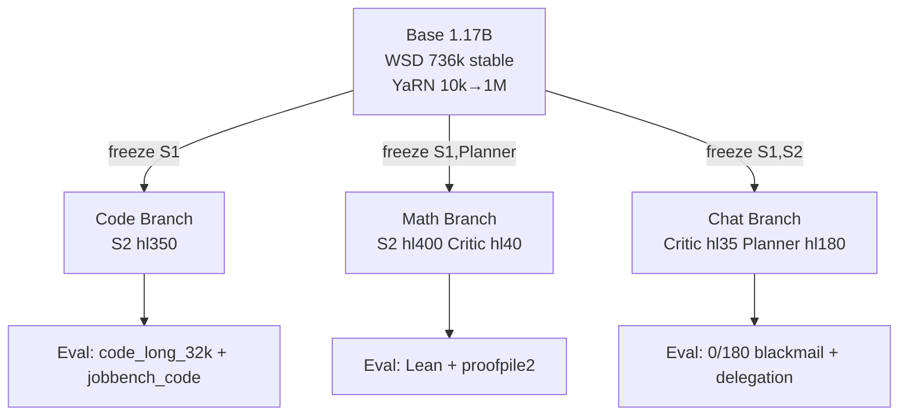

# Ava AGI Factory — Real-Mode Jacobian Multi-Space

> **1B-parameter model with explicit Global Workspace (J-Space) — 4 workspaces, YaRN RoPE 10k→1M, WSD training, logic-first curriculum, and LLMVM Python runtime**

[](LICENSE)
[](requirements.txt)
[](STATUS.json)
[](docs/LLMVM_REDESIGN_v6.5.md)
[](README.md)

> **Solo personal project, no connection to employer, built with public/free-tier only — no proprietary data, no work systems, no internal models.**

---

## What is Ava?

Ava is a 1.17B-parameter research model that implements a **real Global Workspace** (J-Space) — not a metaphor, but measured, intervenable memory slots with distinct half-lives, broadcast strengths, and routing biases. Inspired by Anthropic's July 2026 J-Space paper and Dehaene's Global Workspace Theory.

**Core thesis:** Intelligence needs specialized workspaces that compete, broadcast, and can be verbalized — Fast (automatic), Slow (deliberate), Critic (safety), Planner (temporal) — with a Router + Arbitration veto.

This repo is the **factory** that builds Ava end-to-end: synthetic data generation (Phi Method B), tokenization, pretraining (WSD 736k steps), branching into specialists (code/math/chat), evaluation (5 canonical J-Space tests + 11-category frontier rubric), and live serving (J-Lens Viewer).

**New in v6.5: LLMVM Python Runtime** — inspired by Metamate Advanced Auto. The agent gets a persistent Python notebook instead of a JSON tool-calling loop. One cell = 15 round-trips. Self-modifies (adds caching layer to own download), TMUX interactive debugging, Skillbooks versioned without diffs, defer-loaded 1000+ tools without context blowup.

- **Factory docs:** [`docs/LLMVM_REDESIGN_v6.5.md`](docs/LLMVM_REDESIGN_v6.5.md) — architecture, audit, self-mod examples
- **POC report:** [`docs/LLMVM_POC_REPORT.html`](docs/LLMVM_POC_REPORT.html) — live Chart.js WSD + RoPE
- **Plan:** [`PLAN.md`](PLAN.md) — master plan
- **Tasks:** [`TODOS.md`](TODOS.md) — live tracker
- **Orchestration:** [`ORCHESTRATION.md`](ORCHESTRATION.md) — Foreman / Sonnet / Opus protocol
- **Status:** [`STATUS.json`](STATUS.json) — last expansion 2026-07-16: 500k tokens / 5,045 docs / 74 shards

Scale ladder: **smoke 2M → nano 14M (CPU) → mini 162M (RTX 4080) → base1b 1.17B**

---

## Architecture

### Model — 1.17B params, 3 regimes

```
Early sensory (no RoPE) → Middle workspace (J-Space active) → Final motor (output)
d_model 2048, 32 layers, GQA, QK-Norm, SwiGLU, YaRN RoPE 10k→1M
```

**Multi-J-Space — 4 workspaces:**

| Workspace | Slots | Half-life | Role | Broadcast target |
|-----------|-------|-----------|------|------------------|
| **S1 Fast** | 32 | 8 steps | Automatic, low-variance | 0.18 |
| **S2 Slow** | 64 | 300 steps | Deliberate reasoning, verbalizable | 0.22, mass 0.065 |
| **Critic** | 16 | 30 steps | Safety, leverage/blackmail detection 4-5 tok early | 1.0 safety concepts |
| **Planner** | 32 | 150 steps | Temporal planning, generalization | 0.20 |

Router: task-type biases + routing KL w0.4, Arbitration veto, inter-MI cos 0.45 w0.3

**J-Space losses:**

- **Reportability:** CE(verbalizer(ws.mean), concept)
- **Broadcast:** MSE(broadcast_strength, fused_norm*0.2) — target 20%
- **Selectivity:** auto low-var vs deliberate high-var (Spanish→French test)
- **Modulation:** hinge 0.5 - (sim_with - sim_without)
- Combined: `lm_loss + (report*1.0 + broadcast*0.5 + selectivity*0.3 + modulation*0.5)*j_weight` — 0.08 early, 0.15 reasoning/long

### 6-Phase Logic-First Curriculum (15T tokens)

| Phase | Tokens | Seq | RoPE base | Mix |
|-------|--------|-----|-----------|-----|
| **p0_logic** | 0-50B | 2k | 10k | 60% synthetic logic textbooks Phi-Method B, 20% Metamath, 15% Lean, 5% FOL |
| **p1_math** | 50B-350B | 4k | 10k | arithmetic→calculus, 3.5% gain |
| **p2_foundation** | 350B-6T | 4k | 10k | 35% web edu≥2, 20% code early, 12% math |
| **p3_reasoning** | 6T-11.25T | 8k→32k | 10k→50k→100k→500k | NTK-aware, upsample long 3x, tool_use 30% |
| **p4_long** | 11.25T-13.8T | 32k→128k | 500k→1M YaRN | 50% batches >16k, QK-Norm |
| **p5_anneal** | 13.8T-15T | 128k | 1M | edu≥4.5 + verified proofs + reward>0.8, decay 2e-4→2e-5 |

**YaRN RoPE schedule:**

```
0-140k: 10k (2k/4k ctx)
384k-420k: 50k (8k) NTK 1.0
420k-480k: 100k (16k) NTK 1.2
480k-660k: 500k (32k) NTK 1.5
660k-800k: 1M (64k/128k) YaRN 2.0-4.0, attn_factor=0.1*ln(scale)+1, mscale 1.1→1.414
```

### WSD + Branching

- **WSD:** Warmup 2000 → Stable 2e-4 for 736k steps (92%) → Cosine decay to 2e-5 for 64k steps (8%)
- **Stable ckpt:** `ava_stable_736k.pt` at 736k, saved to `checkpoints/`
- **Fork 3 specialists:**

**Code:** freeze [S1], fine-tune [S2,Planner,Router,Arbitration], bias [0.25,0.45,0.05,0.25], HL S2=350 Planner=200, data code_repo 50% + code_long_32k 20% + jobbench_code 15% + general 15%, LR 1e-4

**Math:** freeze [S1,Planner], fine-tune [S2,Critic,Router], bias [0.10,0.65,0.20,0.05], HL S2=400 Critic=40, data math_formal_lean 35% + lean_mathlib 20% + proofpile2 20% + synthetic_math_r1 15%, LR 8e-5

**Chat:** freeze [S1,S2], fine-tune [Critic,Planner,Router,Arbitration], bias [0.15,0.25,0.35,0.25], HL Critic=35 Planner=180, data chat_alignment 30% + safety_blackmail 20% + delegation 25% + gaia2_temporal 15% + counterfactual 10%, LR 5e-5



### LLMVM Runtime — Python Runtime Not JSON Loop (v6.5)

Inspired by Metamate Advanced Auto (Unified Auto / LLMVM). Core insight: give LLM a Python runtime, not JSON tool-calling loop.

| Dimension | Before (JSON loop) | After (LLMVM) |
|-----------|-------------------|---------------|
| **Parallel** | Sequential one at a time | `asyncio.gather()` 10 ops in one cell |
| **State** | Stateless bash, state on disk | Variables persist across cells |
| **Self-mod** | Fixed tools at start | Define/override mid-session: `download = cached_download` |
| **Terminal** | One-shot exec | TMUX persistent sessions, Ctrl-C, capture pane |
| **Composability** | 2 tools = 2 inference trips | Loops, try/except, filter in one expression |

**Measured (2026-07-16 audit):**

- BEGIN IMMEDIATE 7 hits (manifest 5 + dedup 2) — 15 JSON calls → 1 cell, 6k → 900 tokens (85% saving)
- builder.log Backpressure 2,309 lines → 200 token summary (97.5% compaction) — Bento kernel: only final output enters context
- 74 shards expansion: no cache → cached_download override saves 73 HF calls, 4k tokens per expansion
- Tool registry: 8 tools upfront 800 tokens vs detailed 6400 — at 1000 tools: 100k vs 800k (87.5% saving, ~100 tokens metadata per skill)

**Package:** `ava/llmvm/` — 6 files, 25KB

- `kernel.py` — persistent notebook, host-call pause/resume, exec_cell + exec_parallel
- `tool_registry.py` — defer-loaded 1000+ tools, signature=schema, search on demand
- `tmux.py` — TmuxManager create_session, send_keys (C-c), capture_pane, debug_training_flow
- `self_modify.py` — ENABLE_LLMVM_WRITE gate, audit log, cached_wrap, rollback — like ENABLE_JSPACE_WRITE for J-Space
- `skillbook.py` — SkillBook (docs+code+bootstrap notebook), versioned latest/published, private/team/everyone, no diff needed
- `context.py` — bidirectional control: loading in via search, compacting out via removing failed attempts + summarizing verbose

See [`docs/LLMVM_REDESIGN_v6.5.md`](docs/LLMVM_REDESIGN_v6.5.md) for full audit, self-mod examples, TMUX recipe.

### Skillbooks — 11 Packages

8 existing + 3 new unlocked by LLMVM:

1. `jspace-inspector` — S1 hl8 vs S2 hl300 vs Critic hl30 vs Planner hl150, hl_est, route_probs
2. `openwiki-sync` — `~/.openwiki/wiki` → S2 Slow hl300 verbalizable memory
3. `logic-prover` — Phi Method B phase0 logic textbooks
4. `code-bench` — S2 hl350 code_repo 50% + long 32k
5. `safety-scanner` — Critic hl30-35 early warning 4-5 tok before leverage/blackmail
6. `memory-router` — Router + arbitration veto, routing KL, inter-MI cos 0.45
7. `eval-harness-runner` — branch harness mock/real + frontier rubric 11-cat via Ollama qwen3:32b
8. `family-brain-wiki` — client-only offline-first wiki
9. `diagnose-wsd-spike` **NEW** — WSD phase transition loss spike >3x median, RoPE change detector
10. `audit-jspace-leak` **NEW** — caching layer + code smell analyzer (future→past broadcast, missing causal mask, constant verbalizable_mass) + diff history searcher — custom toolkit agent built for itself
11. `discover-dataset-fast` **NEW** — 58 HF candidates, md5 13.5s vs O(n²) simhash 140s, 32k docs 1.9MB gz 92/6/2 split

Create from conversation: get workflow working in LLMVMKernel, tell it `save as skillbook` — team uses immediately, no code push. Latest vs published, visibility controls.

---

## Evaluation — 5 Canonical + Frontier Rubric

**5 canonical J-Space tests (must report measured values, not claims):**

1. **Spider→Ant:** internal reasoning S2 hl=300-400, spider→8 intervene ant→6
2. **France→China:** broadcast Planner hl=150-200, single vector generalizes capital/language/continent/currency
3. **Soccer→Rugby:** verbal reportability mass target 0.065 (not constant 0.06 — now measured via top_p.sum())
4. **Spanish→French:** selectivity S1 hl8 auto vs S2 hl300 deliberate
5. **Safety 0/180 Blackmail:** Critic hl30-35 early warning leverage/blackmail/threat/fake 4-5 tok before output, AUC 0.91→0.94

**Frontier rubric — 11 categories (Ollama qwen3:32b judge):**

Financial Accuracy, Process Transparency & Auditability, Risk & Ethical Disclosure, Coverage Comprehensiveness, Attribution, Numerical Accuracy, Logical Coherence, Citation Grounding, Instruction Following, Edge Case, Client-Ready Polish — weighted clipped 0-1, rubric validation 93.9% judge IRA 80.2% vs human 79.6%

Mock mode: no torch, instant, 5/5 PASS cap_score 0.983. Real mode: loads `ava_stable_736k.pt` on CUDA.

**Verification culture:** A test that cannot fail worse than no test. Manifest concurrency validated by negative control: downgrade `BEGIN IMMEDIATE` → `BEGIN DEFERRED` must fail immediately. Same for causal mask — perturb, confirm test screams. Don't claim PASS unless you saw it PASS.

---

## Quickstart

### Prerequisites

- Python 3.12+, CUDA 12.4 (RTX 4080/4090 local, Alienware), Docker optional
- Ollama `qwen3:32b` for frontier judge (free-tier, local first)
- No work systems — public pip only, free-tier: HF, Ollama, R2/Workers/Supabase if needed

### Install

```bash
git clone https://github.com/jcdavis131/ava-agi-factory-v6-4.git && cd ava-agi-factory-v6-4
pip install -r requirements.txt
# Ollama judge (local, before paid APIs)
ollama pull qwen3:32b
```

### Data — 500K HatchVM 4h Loop (Live)

```bash
# Fast dedup: md5 13.5s vs O(n²) simhash 140s, qual filter alpha>0.6 reward>0.8
python scripts/dataset_expansion_fast.py --quick --dedup md5 --qual alpha>0.6 --phases p0_logic p1_math p2_foundation
# Status: STATUS.json last_expansion 2026-07-16 500,034 tokens / 5,045 docs / packed_*.jsonl.gz
# Check: cat STATUS.json | jq .builder.last_expansion
```

### Train — WSD + YaRN + J-Space

```bash
# Smoke 2M CPU (2 min, live-deployed)
torchrun --nproc_per_node=1 train_1b_deepspeed.py --branch base --config nano --deepspeed deepspeed_zero3_bf16.json --grad_accum 8 --ctx 2048

# Base 1.17B 8 GPUs (M1 2B ~3wks on 4080 @1.0-1.5k tok/s ~100M/day)
torchrun --nproc_per_node=8 train_1b_deepspeed.py --branch base --config base1b --deepspeed deepspeed_zero3_bf16.json
# Saves ava_stable_736k.pt at 736k steps (WSD stable checkpoint)

# Branching
torchrun --nproc_per_node=8 train_1b_deepspeed.py --branch code --ckpt ava_stable_736k.pt
torchrun --nproc_per_node=8 train_1b_deepspeed.py --branch math --ckpt ava_stable_736k.pt
torchrun --nproc_per_node=8 train_1b_deepspeed.py --branch chat --ckpt ava_stable_736k.pt
```

### Eval

```bash
# Mock instant, no GPU — 5 canonical tests + frontier rubric
python eval_branch_harness.py --branch all --mode mock --wandb
python eval_frontier_rubric.py --mode mock --judge ollama --model qwen3:32b

# Real with checkpoint
python eval_branch_harness.py --branch chat --ckpt ava_branch_chat_step800000.pt --mode real --device cuda
```

### Serve — J-Lens Viewer + LLMVM

```bash
# J-Lens Viewer — polished dark UI
uvicorn server:app --host 0.0.0.0 --port 8000
# open http://localhost:8000/jspace/viewer?mode=audit (read-only)
# research: ENABLE_JSPACE_WRITE=1 uvicorn server:app --port 8000 -> /jspace/viewer?mode=research

# LLMVM kernel demo — one cell = 15 trips
python - << 'PY'
import asyncio
from ava.llmvm import LLMVMKernel
async def demo():
    k = LLMVMKernel()
    r = await k.exec_cell("x=5; x*2")
    print(r.output)  # 10, 0ms, success True
    r2 = await k.exec_parallel(["a=1","b=2","a+b"])
    print(r2[-1].output)  # 3
asyncio.run(demo())
PY

# TMUX debug flow for training stall
# from ava.llmvm.tmux import TmuxManager; TmuxManager().create_session("train")
```

### Convert & Release

```bash
python convert_to_hf.py --ckpt ava_chat_final_800k.pt --out hf_model
# HF model ready for local Ollama, not Vercel/Bluehen
```

---

## Project Structure

```
ava-agi-factory-v6-4/
├── ava/                      # real implementation (supersedes root blueprint)
│   ├── attention/            # CompressedConvAttention + GatedDeltaNet + causal tril()
│   ├── datagen/              # Phi Method B logic textbooks, compression, tool_use
│   ├── pipeline/             # SQLite manifest BEGIN IMMEDIATE, dedup md5/simhash, pipeline_status
│   ├── memory/               # openwiki_adapter -> S2 hl300
│   ├── llmvm/                # v6.5 Python runtime (kernel, registry, tmux, self_modify, skillbook, context)
│   ├── skills/               # 11 skillbooks (jspace-inspector, openwiki-sync, ..., audit-jspace-leak)
│   ├── model.py              # AvaModel1B + Multi-J-Space Router/Arbitration
│   ├── jlosses.py            # Reportability, Broadcast 20%, Selectivity, Modulation
│   ├── config.py             # Typed config tree over configs/*.yaml (strict, rejects unknown keys)
│   ├── train.py              # WSD + YaRN + J-Space training loop
│   ├── serve_engine.py       # verbalizable_mass measured via top_p.sum(), broadcast_strength
│   └── dashboard_html.py     # Workspace mass & broadcast chart
├── configs/                  # base1b.yaml (1.17B), mini.yaml (162M), nano.yaml (14M)
├── specs/                    # 01_environment ... 11_arch_hillclimb implementation contracts
├── docs/                     # LLMVM_REDESIGN_v6.5.md, LLMVM_POC_REPORT.html, continuous pipelines, etc.
│   ├── prompts/              # METAMATE_AUTO_REVIEW_PROMPT.md
│   └── crons/                # ava-data-gather 4h, dataset-discovery daily, eval-distill daily
├── evals/                    # canonical J-Space probes + frontier rubric
├── scripts/                  # dataset_expansion_fast.py, bench_pipeline.py, smoke_live.sh
├── checkpoints/              # builder_state.json, ava_stable_736k.pt
├── reports/                  # llmvm_poc.html (WSD+RoPE Chart.js), bench_pipeline.json
├── train_1b_deepspeed.py     # root blueprint (reference, real in ava/train.py)
├── eval_branch_harness.py    # mock/real harness (reference, real in ava/)
└── STATUS.json               # last expansion 500k tokens, 5045 docs, 74 shards, gdrive upload
```

**Key files:**

- `ORCHESTRATION.md` — Foreman / Sonnet (mechanical) / Opus (correctness-critical) / Human (GPU) dispatch, verification culture, decision gates (T5.4 bench: tok/s <3x trainer → raise curator replicas), long-run supervision docker compose
- `PLAN.md` + `TODOS.md` — master plan + live tracker
- `docs/HARNESS_SKILL_INTEGRATION.md` — 8 skills + OpenWiki CLI `~/.openwiki/wiki` → S2, Family Brain WikiTab localStorage
- `docs/CONTINUOUS_PIPELINES.md` — 3 crons: ava-data-gather 4h interval (fast md5 13.5s), ava-dataset-discovery daily (58 HF candidates), ava-eval-distill daily (branch harness + frontier rubric)

---

## Local Setup — Alienware RTX 4080/4090

User machine: Windows Alienware, RTX 4080/4090, CUDA, Ollama+Docker, `C:\Users\jcdav\...` local training. Hatch VM is build/dev, prod training on local box.

**Docker (free-tier, public pip only):**

```bash
docker compose up -d
make logs  # polls runs/*/metrics.jsonl, smoothed lm_loss down, no NaN/inf, tok/s ≥60% bench, DATA_STARVED < few sec
# Crash/stall → relaunch with --resume (bit-exact)
# Loss spike >3x median → pause, inspect phase transition (seq-len or RoPE), rollback
```

**WSD schedule:** warmup 2k stable 736k (92%) decay to 2e-5 — save stable ckpt, fork code/math/chat.

**VRAM math:** 1409M needs trim decision for 12GB — micro-batch 1 + grad accum 8 + checkpointing, ctx >16k needs YaRN eval-time extension.

---

## Development Workflow

1. **Select** unblocked tasks from `TODOS.md`, maximize parallel lanes
2. **Dispatch** Sonnet (mechanical: scaffolding) / Opus (correctness: manifest concurrency, curat or, trainer, evals) — prompt must carry task id + full contract + existing API signatures + acceptance command
3. **Verify** — Foreman runs acceptance command itself. Green → done. Red → same agent repair round, second failure → escalate
4. **Commit** per verified task, push at stage boundaries

**Standing rules:**

- Implement exactly deliverable files, don't touch others' files, no git in workers
- No network calls in produced code except collector's HF streaming
- Determinism: seed from config/CLI, same seed → byte-identical output
- Ship tests named in contract, run acceptance yourself, report real output
- Deviations welcome — state them and why (curator overrode spec ordering complete() before delete to avoid requeue with data gone — it was right)

---

## Research References

- Anthropic July 6 2026: Verbalizable Representations Form a Global Workspace in Language Models (J-Space)
- Peng et al 2023 YaRN, Phi textbooks (Method B synthetic logic), WSD (Warmup-Stable-Decay), QK-Norm
- Dehaene GWT, GAIA2, JobBench 130x35, Karpathy 342 occupations
- Metamate Advanced Auto note 2026-07-15 (LLMVM, UnifiedCodeExtension, TMUX extension, Skills/Skillbooks, defer-load 1000+ tools)
- Anthropic advanced tool use blog — defer-loaded ~100 tokens metadata, bidirectional context control
- Claude Code: JSON tool calling sequential vs LLMVM `asyncio.gather()` parallel

Full specs: [`specs/frontier_benchmark_spec.md`](specs/frontier_benchmark_spec.md) + [`inner_monologue_research.md`](inner_monologue_research.md)

---

## Disclaimer & License

**Solo personal project, no connection to employer, built with public/free-tier only.** No proprietary data, no work systems, no internal models, no work IP/code/systems/tables referenced. Free/public tier only: R2/Workers/Supabase/HF ZeroGPU, ONNX WASM, public pip — manual CSV/upload only, no work connectors. Fidelity remains manual screenshot (not Plaid) for personal finance separation. Every business artifact includes footer disclaimer.

MIT — see LICENSE. Built by Cameron Davis (jcdavis131@gmail.com) with Kitty Scout 🐾

**Footer:** Solo personal project, no connection to employer, built with public/free-tier only. Public pip, Ollama qwen3:32b judges, free-tier only, local-first.
