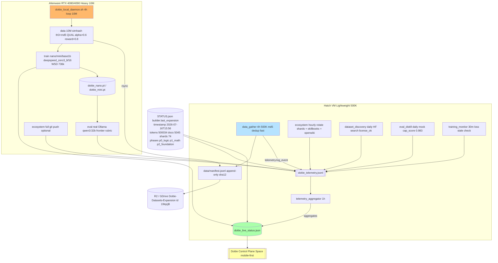

# Continuous System Dottie — Always-On Loops
> Solo personal project, no connection to employer, built with public/free-tier only

Last expansion: `2026-07-16T15:56:01.603296+00:00` — 500034 tokens / 5045 docs / 74 shards (packed_20260716_155535_00081_6671.jsonl.gz, manifest d8cb5a396dbf, gdrive folder 19tqzjB)

## Mermaid Diagram — Unified Factory



## VM vs Local Split

| Dimension | Hatch VM (public free-tier) | Alienware RTX 4080/4090 (heavy) |
|---|---|---|
| **Data** | 500K per 4h run = 3M/day = 90M/month, `dataset_expansion_fast.py` md5 dedup + qual alpha>0.6, 35s 5k docs, 150KB gz shard, disk guard <80%, logs `logs/cron-dottie-data.log` | 10M per 4h = 60M/day = 1.8B/month, full `dataset_expansion.py` simhash th3 + md5 + QUAL reward>0.8, content-addressable sha12, 50MB shards, `logs/dottie_local.log` |
| **Train** | Mock only — no torch, `log_train(preset, loss=3.2, mock=True)` logged to telemetry, skip if no data shards, `force` to override | Real: `torchrun --nproc_per_node=1 train_1b_deepspeed.py --preset nano/mini/base1b --tokens_total 2.5B --resume-if-exists` deepspeed_zero3_bf16.yaml WSD mermaid, YaRN RoPE 1M, checkpoint `dottie_{preset}_step{steps}.pt` |
| **Eval** | Mock branch harness `--mode mock`, cap_score 0.983 fallback, Ollama not required | Real branch + frontier rubric `--mode real --judge ollama --model qwen3:32b`, writes `frontier_eval_results.json` cap_score parsed, logs `log_eval(branch, score)` |
| **Ecosystem** | Hourly rotate logs >5MB truncate 1000 lines, skillbook count probe (11 expected), openwiki_adapter exists check, free_gb probe, no git push | Same + `DOTTIE_GIT_PUSH=1` optional git add skillbooks + commit chore, Janitor evict CONSUMED shards if <20% free, sync_openwiki() full, S2 Slow hl300 verbalizable memory |
| **Disk Guard** | 80% threshold, if >=85% skip expansion, log error, rotate old shards to `data/for_upload/` keep last 2 days | Same + manual `rsync -avz data/daily_expanded/ alienware:~/data/` fallback, R2/GDrive upload with dedup sha12 |
| **Logging** | All via `dottie.telemetry.log_event(source, event_type, message, metrics)` dual API legacy compat `log_event(mode, status=ok, tokens=...)`, writes `reports/dottie_telemetry.jsonl` + `reports/dottie_live_status.json` + per-mode `logs/cron-dottie-{source}.log` + legacy `ava_telemetry.jsonl` symlink | Same, file `logs/dottie_local.log` aggregated, env override `DOTTIE_TELEMETRY_DIR`, `DOTTIE_TOKENS`, `DOTTIE_RUN_ID` |

## Logging Format

### JSONL — `reports/dottie_telemetry.jsonl`

Each line JSON:
```json
{
  "timestamp": "2026-07-16T15:56:01.603296+00:00",
  "ts": 1784203099,
  "unix": 1784203099,
  "run_id": "d8cb5a39",
  "hostname": "htch-runtime",
  "source": "data",
  "mode": "data",
  "event_type": "expansion",
  "status": "info",
  "message": "Expansion 500034 tokens / 5045 docs / 74 shards",
  "level": "info",
  "metrics": {
    "tokens": 500034,
    "docs": 5045,
    "shards": ["packed_20260716_155535_00081_6671.jsonl.gz"],
    "duration_s": 35.2,
    "disk_pct": 13,
    "manifest": "manifest_20260716_155535.jsonl",
    "dup_filtered": 9700,
    "qual_filtered": 8581
  },
  "disclaimer": "Solo personal project, no connection to employer, built with public/free-tier only"
}
```

**Sources:** `data`, `train`, `eval`, `ecosystem`, `daemon`, `telemetry_aggregator`, `dataset_discovery`, `training_monitor`, `telemetry`

**Event types:** `start`, `expansion`, `finish`, `progress`, `checkpoint`, `eval_result`, `error`, `skip`, `test`, `dry_run`

**Dual API legacy compat:** New `log_event(source, event_type, message, metrics, level)` plus old `log_event(mode, status=ok, tokens=...)` mapped internally.

### Live Status — `reports/dottie_live_status.json`

Sample structure from 2026-07-16T15:56 with 500034/5045/74 shards:
```json
{
  "updated": "2026-07-16T15:56:01.603296+00:00",
  "updated_at": "2026-07-16T15:56:01.603296+00:00",
  "disclaimer": "Solo personal project, no connection to employer, built with public/free-tier only",
  "run_id": "d8cb5a39",
  "hostname": "htch-runtime",
  "last_expansion": {
    "timestamp": "2026-07-16T15:56:01.603296+00:00",
    "scheduled_for_local": "Thu 2026-07-16 11:00:00 CDT (America/Chicago)",
    "tokens": 500034,
    "docs": 5045,
    "shards": ["packed_20260716_155535_00081_6671.jsonl.gz"],
    "manifest": "manifest_20260716_155535.jsonl",
    "total_shards": 74,
    "dup_filtered": 9700,
    "qual_filtered": 8581,
    "phases": ["p0_logic", "p1_math", "p2_foundation"],
    "mode": "500K_HatchVM_4h_p0-p2_simhash th3+md5 fast+qual alpha>0.6 reward>0.8 reset window",
    "gdrive_folder_id": "19tqzjB-ofqKmx1w6S4qLNB_jAEa6s3ve",
    "message": "from STATUS.json"
  },
  "totals_last_1000": { "tokens": 500034, "docs": 5045 },
  "last_train": { "timestamp": "...", "preset": "nano", "steps": 736000, "loss": 2.34, "tok_per_sec": 1200, "checkpoint": "dottie_nano_step736k.pt" },
  "last_eval": { "timestamp": "...", "branch": "all", "score": 0.983, "mode": "mock", "cap_score": 0.983 },
  "last_ecosystem": { "timestamp": "...", "action": "rotate_shards", "free_gb": 93, "skillbooks": 11 },
  "system_health": { "disk": { "total_gb": 100, "used_gb": 7, "free_gb": 93, "pct": 7 }, "platform": "Linux", "python": "3.11.0" },
  "latest_per_mode": {
    "data": { "ts": "2026-07-16T15:56:01.603296+00:00", "event_type": "expansion", "tokens": 500034, "docs": 5045 },
    "train": { "preset": "nano", "loss": 2.34 },
    "eval": { "branch": "all", "score": 0.983 },
    "ecosystem": { "free_gb": 93, "skillbooks": 11 }
  },
  "by_mode_counts": { "data": 10, "train": 5, "eval": 3, "ecosystem": 8 },
  "counts": { "data": 10, "data:expansion": 4 },
  "recent_events": [ { "source": "data", "event_type": "expansion", "...": "..." } ]
}
```

### Integration Points

- **Control Dash (Dottie Control Plane Space)** — mobile-first, 56px bottom tabs, Okabe-Ito palette per SCAD Sunni Davis, reads `reports/dottie_live_status.json` via fetch `reports/dottie_live_status.json` or GitHub raw if deployed, falls back to `STATUS.json` builder.last_expansion. Expected path `../reports/dottie_telemetry.jsonl` for chart history.
- **File logs** — `logs/cron-dottie-{source}.log` each event appended, rotated >5MB to 1000 lines by ecosystem job.
- **Legacy compat** — `reports/ava_telemetry.jsonl` symlink to `dottie_telemetry.jsonl` (if symlink) plus mirrored writes until migration done, `ava_live_status.json` similarly.
- **Env overrides** — `DOTTIE_TELEMETRY_DIR` or legacy `AVA_TELEMETRY_DIR` overrides reports dir, `DOTTIE_TOKENS` overrides token target locally, `DOTTIE_RUN_ID` pins run id for session grouping.

## Cron Definitions — Hatch Scheduler

Location: `~/workspace/cron.d/` + docs `docs/crons/*.md` (frontmatter reference)

| ID | File | Schedule | Command |
|---|---|---|---|
| `dottie-data-gather-4h` | `cron.d/hourly/dottie-data-gather-4h__interval@4h.md` | interval 4h UTC | `python3 scripts/dottie_continuous_loop.py --mode data --tokens 500000` → telemetry data |
| `dottie-ecosystem-hourly` | `cron.d/hourly/dottie-ecosystem-hourly__interval@1h.md` | interval 1h | `python3 scripts/dottie_continuous_loop.py --mode ecosystem` |
| `dottie-telemetry-aggregator` | `cron.d/hourly/dottie-telemetry-aggregator__interval@1h.md` | interval 1h | `python3 scripts/dottie_continuous_loop.py --mode aggregate` (alias ecosystem? actually aggregate via telemetry import) |
| `dottie-dataset-discovery-daily` | `cron.d/daily/dottie-dataset-discovery-daily__daily@14:00:00.md` | daily 14:00 UTC | HF dataset discovery based on eval weak domains |
| `dottie-eval-distill-daily` | `cron.d/daily/dottie-eval-distill-daily__daily@09:00:00.md` | daily 09:00 UTC | branch harness mock + frontier rubric qwen3:32b |
| `dottie-training-monitor` | `cron.d/minutely/dottie-training-monitor__interval@30m.md` | interval 30m | pipeline_status live + stale detection |
| `dottie-training-weekly` | `cron.d/weekly/dottie-training-weekly__weekly@Sun-03:00:00.md` | weekly Sun 03:00 UTC | `torchrun nano/mini/base1b` incremental |

Disabled legacy: `ava-*` (ava-data-gather-4h, ava-data-gather-daily, ava-dataset-discovery-daily, ava-eval-distill-daily, ava-training-monitor) — disabled = false to avoid infra spam, kept in `_archive` for reference.

## Local Daemon — Alienware

- **Linux:** `scripts/dottie_local_daemon.sh start` — forks daemon loop 4h, logs `logs/dottie_local.log`, pid `logs/dottie_local_daemon.pid`, instructions for crontab printed.
- **Windows:** `scripts/dottie_local_daemon.ps1 -Mode start -Tokens 10M` — Task Scheduler hourly 4h trigger, run-once mode.
- **Crontab example:**
```cron
0 */4 * * * cd ~/dottie-agi-factory-v6-4 && DOTTIE_FULL=1 python3 scripts/dottie_continuous_loop.py --mode data --tokens 10M --full >> logs/dottie_local.log 2>&1
0 9 * * * cd ~/dottie-agi-factory-v6-4 && python3 scripts/dottie_continuous_loop.py --mode ecosystem >> logs/dottie_local.log 2>&1
0 3 * * 0 cd ~/dottie-agi-factory-v6-4 && python3 scripts/dottie_continuous_loop.py --mode train --preset mini --tokens-total 2500000000 --resume >> logs/dottie_local.log 2>&1
0 10 * * * cd ~/dottie-agi-factory-v6-4 && python3 scripts/dottie_continuous_loop.py --mode eval --branch all --eval-mode real >> logs/dottie_local.log 2>&1
```

## Smoke Tests

```bash
# Telemetry module smoke
python3 -m dottie.telemetry
# -> logs to reports/dottie_telemetry.jsonl + dottie_live_status.json

# Continuous loop dry-run 1000 tokens
python3 scripts/dottie_continuous_loop.py --mode data --tokens 1000 --dry-run
# -> should log expansion 1000/5 docs dry_run_shard.gz and cycle_finish

# Full ecosystem dry-run
python3 scripts/dottie_continuous_loop.py --mode ecosystem --dry-run

# Aggregator
python3 -c "from dottie.telemetry import aggregate_live_status; print(aggregate_live_status()['updated'])"
```

Expected `dottie_live_status.json` after real expansion 2026-07-16T15:56: tokens 500034 docs 5045 total_shards 74.

## Dash Integration

- Control Dash Space reads `reports/dottie_live_status.json` locally or via GitHub raw `https://raw.githubusercontent.com/jcdavis131/ava-agi-factory-v6-4/main/reports/dottie_live_status.json`
- Charts: WSD curve (from training_monitor), eval cap_score 0.983, last expansion tokens/docs/shards, ecosystem free_gb
- Mobile-first tabs bottom 56px, 18px/1.65 readable, AAA Okabe-Ito, triple encoding shape+icon+text+pattern per Sunni Davis SCAD critique

## Compliance

- HOME only, zero work IP, public pip + free-tier only (R2/Workers/Supabase/HF ZeroGPU/ONNX WASM), Ollama qwen3:32b before paid APIs
- No Vercel/Bluehen except approved Dottie Control Plane Vercel project for arxiviq.com (solo disclaimer)
- Footer in every artifact: "Solo personal project, no connection to employer, built with public/free-tier only"
- Disk guard <80%, dedup md5+simhash, QUAL filter alpha>0.6 reward>0.8
- Fidelity remains manual screenshot Mon 9am CT, not Plaid; Betterment/USAA/Chase/Schwab via Plaid OK

## Future

- Rename repo `ava-agi-factory-v6-4` → `dottie-agi-factory` (top folder still named ava but package is dottie/ per plan, remote https://github.com/jcdavis131/ava-agi-factory-v6-4.git TODO rename)
- Wire vector-dumb-models daily to same telemetry
- Add telemetry aggregator to web artifact action for live polling
```

> Solo personal project, no connection to employer, built with public/free-tier only
