# Ava v6.5 LLMVM Redesign — From JSON Loop to Python Runtime
> **Solo personal project, no connection to employer, built with public/free-tier only**

Date: 2026-07-16 | Trigger: Metamate Advanced Auto (Unified Auto / LLMVM) | Owner: Home Scout
Source prompt: `docs/prompts/METAMATE_AUTO_REVIEW_PROMPT.md`

## TL;DR — Why Python Runtime, Not JSON Loop

**3 bullets with one concrete example from builder.log:**

1. **One cell = 15 round-trips.** Builder.log 2026-07-09 17:43:58-17:47:14 shows 103 identical `Backpressure: 27 shards pending > 20` messages over 3m16s — each required separate JSON tool call, framework exec, LLM decision. In LLMVM: `asyncio.gather(search_logs("Backpressure"), read_manifest(), check_curator_tokps())` in one cell, 1 inference pass.

2. **Emergent > designed.** No tool exists for "search 3 patterns (BEGIN IMMEDIATE vs DEFERRED, causal mask missing, verbalizable_mass constant 0.06), filter deprecated, summarize top 5". In JSON you hand-write 16-line schema per function. In LLMVM, you write Python — regex, matrix algebra, charts — LLM already knows it from training.

3. **Self-modification is the unlock.** Ava's data gather calls `download()` 74 times per expansion (74 shards, see STATUS.json 2026-07-16), no cache, 27 shards pending. Agent rewrites `download = cached_download` mid-session — every subsequent call hits cache. No new tool, no deploy, immediate token savings. Impossible when tool set fixed at conversation start.

## Audit Table — 5 Current Bottlenecks Measured 2026-07-16

| # | Pipeline | JSON-loop cost (measured) | Failure mode | LLMVM fix | Token savings |
|---|----------|---------------------------|--------------|-----------|---------------|
| 1 | `ava/pipeline/manifest.py` + `dedup.py` BEGIN IMMEDIATE | `grep -rn BEGIN IMMEDIATE` 5 hits, each claim requires 1 JSON call + sqlite lock. 2 procs contending = 2x round-trip per shard. 74 shards x 2 = 148 calls per expansion | Deadlock risk, backpressure 27 pending, sleep 2s loop | `asyncio.gather()` claims in one cell, persistent kernel holds DB handle | 148 calls → 1 cell, ~14k tokens → 900 tokens |
| 2 | `builder.log` verbose → context blowup | builder.log 10k lines, each tool output piles into context whether needed or not. 2026-07-09: 27 identical lines in 3 min, all entered LLM context | Context limit crash at 120k, long sessions fail | Bento kernel sandbox: execution pauses for host, resumes, only final summary enters context. Compaction removes failed/backpressure spam | 8k tokens → 200 token summary, 97.5% reduction |
| 3 | J-Space leak properties unobservable | ORCHESTRATION.md: 3 properties "passing" for years: (a) attention no causal mask, (b) broadcast future→past, (c) verbalizable_mass constant 0.06. No test asserts property, only absence of crash. `grep verbalizable_mass` now measured via top_p.sum() in serve_engine.py but still sampled | Loss drops implausibly fast, capability illusion | Agent defines `audit_jspace_leak()` mid-session with caching + code smell analyzer + diff history searcher — custom toolkit to audit own codebase | 1 cell vs 0 (no tool existed) — new capability, negative control test BEGIN DEFERRED must fail |
| 4 | `eval_branch_harness.py` + `eval_frontier_rubric.py` Ollama judge qwen3:32b | Each eval = sequential bash tool calls stateless between invocations. State lives on disk, not memory. 5 canonical tests + 11-cat rubric = 16 round-trips, each loads checkpoint | 30-45s poll interval, intermediate results pile up, no error handling | Persistent state: variables persist across cells, `run_harness(eval_names=...)` parallel via `asyncio.gather()`, try/except retry logic in same expression | 16 calls → 1 cell with gather(), ~6k → 800 tokens |
| 5 | Dataset discovery 58 HF candidates | `docs/CONTINUOUS_PIPELINES.md`: daily 10:00 UTC scans 58 candidates (13 finance/12 bio/12 code/12 math/9 safety), each needs schema, filter, license check. 58 x JSON schema 16 lines = 928 lines boilerplate | No composition, can't do "search three patterns in parallel, filter deprecated, summarize top five" | Defer-load: only ~100 tokens metadata per skill upfront, agent searches loads detailed defs on demand. Massive toolset creates resilience — code search fail → internal search → wiki | 928 lines schema tax → 0, 58 calls → 1 cell with loop + filter |

**Verification culture note:** Test that cannot fail worse than no test. Manifest concurrency test validated by negative control: downgrade `BEGIN IMMEDIATE` → `BEGIN DEFERRED` must fail immediately. Same for causal mask — perturb implementation, confirm test screams.

## Architecture Diagram — LLMVM for Ava

```mermaid
graph TD
    subgraph LLMVM Kernel [Bento-like Sandbox]
        K[Persistent Python Notebook<br/>globals survive across cells]
        K -->|defines| T1[New tools mid-session]
        K -->|overrides| T2[Cached download, smell analyzer]
        K -->|executes| P[One cell = 15 JSON trips<br/>asyncio.gather, loops, try/except]
    end

    subgraph Orchestrator
        O[Host Call Pauser]
        O -->|pauses| K
        O -->|resumes with data| K
        O -->|only final output| Ctx[LLM Context]
    end

    subgraph Host Calls [Thousands of tools, defer-loaded]
        HF[HF Datasets 58 candidates]
        CUDA[CUDA RTX 4080<br/>nvidia-smi]
        LOGS[builder.log + training logs]
        WIKI[~/.openwiki/wiki -> S2 hl=300]
        OLLAMA[Ollama qwen3:32b judge]
        CODE[Code search ripgrep]
    end

    subgraph TMUX Extension
        TM1[Session train<br/>tail -f logs/builder.log]
        TM2[Session eval<br/>eval_branch_harness --mode real]
        TM3[Session data<br/>dataset_expansion_fast --quick]
        P -->|writes strategy as code| TM1
        P -->|Ctrl+C, capture pane| TM2
    end

    subgraph Skillbooks [Modular packages]
        SB1[jspace-inspector hl=8/300/30/150]
        SB2[openwiki-sync -> S2]
        SB3[diagnose-wsd-spike NEW]
        SB4[audit-jspace-leak NEW]
        SB5[discover-dataset-fast NEW]
        K -->|save as skillbook| SB4
    end

    subgraph Context Control [Bidirectional]
        LOAD[Loading in: tool search 100 tokens]
        COMPACT[Compacting out: remove failed, summarize verbose]
        LOAD --> Ctx
        COMPACT --> Ctx
    end

    K <--> O
    O <--> HF & CUDA & LOGS & WIKI & OLLAMA & CODE
    K <--> TM1 & TM2 & TM3
    K <--> SB1 & SB2 & SB3 & SB4 & SB5
```



## Self-Modification Examples — Real Code Ava Writes

### Example 1: Agent adds caching layer to own download function

```python
# Initial state — from ava/llmvm/tool_registry.py, no cache, 74 shards x download
download_cache = {}

async def download(url: str):
    """Original — fetches every time"""
    import aiohttp
    async with aiohttp.ClientSession() as s:
        async with s.get(url) as r:
            return await r.read()

# Agent realizes mid-audit: "74 shards, 27 pending, no cache — I can fix my own runtime"
# Self-modification — emergent, not pre-designed

from ava.llmvm.self_modify import SelfModifyManager

mgr = SelfModifyManager()
mgr.enable_write("ENABLE_LLMVM_WRITE=1")

original_download = download

async def cached_download(url: str):
    """Patched version — every subsequent call goes through cache"""
    if url in download_cache:
        return download_cache[url]  # hit: saves 1 HF round-trip + tokens
    data = await original_download(url)
    download_cache[url] = data
    return data

# Override — runtime didn't need caching tool, agent created at layer needed
mgr.override_tool("download", cached_download, reason="Builder loop 74 shards repeated URL, cache saves 73 calls")

download = cached_download  # Now every call in kernel uses cache

# Measured: Before 74 downloads / expansion, after 1 download + 73 cache hits
# Token savings: 73 * (tool call + result) ~ 4k tokens per expansion
```

### Example 2: Code smell analyzer + diff history searcher — custom toolkit for audit

```python
# Prompt: "Audit your own codebase like Metamate did"

# One cell — what would be 15 LLM round-trips in JSON:
import re, asyncio
from pathlib import Path

async def search_code(pattern: str):
    # host call — execution pauses, orchestrator fulfills, resumes
    return [p for p in Path("ava").rglob("*.py") if re.search(pattern, p.read_text())]

# Search three patterns in parallel, filter deprecated, summarize top five with error handling
patterns = ["BEGIN IMMEDIATE", "causal.*mask|tril", "verbalizable_mass"]
results = await asyncio.gather(*[search_code(p) for p in patterns])

filtered = []
for r in results:
    for path in r:
        if "deprecated" not in str(path) and "__pycache__" not in str(path):
            try:
                filtered.append((str(path), path.stat().st_mtime))
            except Exception as e:
                print(f"skip {path}: {e}")

top5 = sorted(filtered, key=lambda x: x[1], reverse=True)[:5]

# Now define new tool mid-session to keep finding leaks
def audit_jspace_leak():
    leaks = []
    # check compressed_conv.py has causal tril
    txt = Path("ava/attention/compressed_conv.py").read_text()
    if "causal = torch.ones" not in txt:
        leaks.append("Missing causal mask — loss will drop implausibly fast")
    # check broadcast doesn't leak future
    if "broadcast" in Path("ava/model.py").read_text() and "future" in Path("ava/model.py").read_text():
        leaks.append("Potential future->past broadcast leak")
    # check verbalizable_mass measured not constant
    if "verbalizable_mass = 0.06" in Path("ava").read_text():
        leaks.append("Constant 0.06 still present — should be measured via top_p.sum()")
    return leaks

# Define and use immediately — impossible in tool-calling where set fixed at start
audit_results = audit_jspace_leak()
print(f"Leaks found: {audit_results}, top files: {top5}")

# Save working workflow as Skillbook — no diff needed
from ava.llmvm.skillbook import SkillBookManager
mgr = SkillBookManager()
book = mgr.create_from_conversation(
    name="audit-jspace-leak",
    description="Finds 3 properties passing for years by being unobservable",
    working_code=open(__file__).read()  # this cell's code
)
mgr.publish("audit-jspace-leak", visibility="everyone")
# Now whole team uses it — took ~1 hour iteration as Metamate note said
```

## TMUX Debug Recipe — Copy-paste for Training Stall

Use when: `logs/builder.log` shows Backpressure or loss spike >3x median (ORCHESTRATION.md decision gate)

```bash
# Session 1: train — real interactive terminal, not one-shot exec
tmux new-session -d -s train
tmux send-keys -t train "tail -f logs/builder.log" Enter
# Capture pane output and react:
# python -c "from ava.llmvm.tmux import TmuxManager; m=TmuxManager(); m.create_session('train'); print(m.capture_pane('train', 50))"

# Strategy as code (LLM writes this, executes across panes):
"""
output = tmux.capture_pane('train', lines=100)
if 'Backpressure: 27 shards pending > 20' in output:
    tmux.send_keys('train', 'C-c')
    tmux.send_keys('train', 'python scripts/dataset_expansion_fast.py --quick --dedup md5 --qual alpha>0.6\n')
    tmux.send_keys('train', 'python -m ava.llmvm.kernel --exec "print(context.compact())"\n')
elif 'NaN' in output or 'loss spike' in output:
    tmux.send_keys('train', 'C-c')
    tmux.send_keys('train', 'cat checkpoints/builder_state.json | jq .current_phase\n')
    tmux.send_keys('train', 'python eval_branch_harness.py --branch all --mode mock --wandb | tail -n 40\n')
    # check phase transition: seq-len or RoPE change usual culprit
    tmux.send_keys('train', 'grep -A2 "RoPE" ava/config.py\n')
else:
    tmux.send_keys('train', 'nvidia-smi --query-gpu=utilization.gpu,memory.used,power.draw --format=csv\n')
    tmux.send_keys('train', 'docker compose ps\n')
"""

# Session 2: eval — watches evals in parallel
tmux new-session -d -s eval
tmux send-keys -t eval "watch -n 5 'python eval_branch_harness.py --branch all --mode mock | grep -E \"PASS|FAIL|hl=\"'" Enter

# Session 3: data — interactive data expansion with Ctrl sequences
tmux new-session -d -s data
tmux send-keys -t data "python scripts/dataset_discovery.py --search 'logic math' --top 10" Enter
# If stuck: send Ctrl+C and try something else — real engineering workflow
# tmux send-keys -t data "C-c"
# tmux send-keys -t data "openwiki personal --init && openwiki code --init 'YaRN 10k->1M WSD 736k'\n"

# Combined with Python runtime: write debugging strategy as code and exec across panes
# from ava.llmvm import LLMVMKernel, TmuxManager
# kernel = LLMVMKernel()
# await kernel.exec_cell(tmux.debug_training_flow())
```

## Skillbook Migration Plan

**Current 8 starter skills → Skillbooks (each: docs + Python + bootstrap notebook, versioned latest/published):**

1. `jspace-inspector` → `ava/skills/jspace-inspector/` — Planner hl150, S1 hl8 vs S2 hl300 selectivity, Critic early warning. Bootstrap: `python -m skills.loader run jspace-inspector --mode mock`
2. `openwiki-sync` → S2 hl300 verbalizable memory, `~/.openwiki/wiki` → S2 slots, reportability loss
3. `logic-prover` → phase0 Phi Method B 60% logic textbooks
4. `code-bench` → S2 hl350, code_repo 50% + long 32k 20%
5. `safety-scanner` → Critic hl30-35, 0/180 blackmail, leverage/threat/fake 4-5 tok early warning
6. `memory-router` → Router + arbitration veto, routing KL w0.4, inter-MI cos 0.45
7. `eval-harness-runner` → harness mock instant no torch, real with `ava_stable_736k.pt`
8. `family-brain-wiki` → client-only offline-first, `family-brain-wiki-pages:v1` localStorage, AES-GCM

**3 NEW unlocked by LLMVM (agent built for itself during self-audit):**

9. `diagnose-wsd-spike` — WSD warmup 2k stable 736k 92% decay 2e-5, detects loss spike >3x median at phase transition (seq-len or RoPE change). Example: Metamate debugged session failures skillbook. Takes 1 hour iteration.

10. `audit-jspace-leak` — Caching layer, code smell analyzer (future→past broadcast, missing causal mask, constant verbalizable_mass), diff history searcher. Use: audit codebase in one cell, define tool, override reader with caching, save as skillbook. One-shots nest app analog.

11. `discover-dataset-fast` — Fast md5 13.5s vs O(n²) simhash 140s, 32k docs 1.9MB gz split 92/6/2, filters 58 HF candidates license-filtered to pubmed_qa/medmcqa/humaneval/mbpp in one parallel cell.

**Creation flow (no code push):**
```bash
npm install -g openwiki  # from docs/HARNESS_SKILL_INTEGRATION.md
cd ava-agi-factory-v6-4
openwiki code --init "Document YaRN RoPE 10k->1M, WSD 736k, 4 J-Spaces S1 hl8 S2 hl300 Critic hl30 Planner hl150, branch biases"

# Get workflow working in conversation with Advanced Auto (now LLMVMKernel):
# python -c "from ava.llmvm import LLMVMKernel; ..."
# Tell it to save as skillbook:
# await kernel.exec_cell("skillbook_manager.create_from_conversation(name='audit-jspace-leak', ...)")

# Iterate latest vs published, visibility private/team/everyone
```

## 1000+ Tools, No Context Blowup — Defer-Load Design

**Problem:** If agent has access to all tools from Confucius/DevMate/Metamate equivalent (for Ava: HF, Ollama, W&B, GitHub, OpenWiki, code search, logs, datasets), doesn't that blow up context?

**No — defer-loaded:**

- **Upfront:** ~100 tokens per skill lightweight metadata. For Ava's 11 skillbooks: 1,100 tokens. Lists name, 80-char desc, namespace.
  ```python
  from ava.llmvm.tool_registry import create_ava_registry
  reg = create_ava_registry()
  lightweight = reg.list_lightweight()  # 11 * 100 = 1,100 tokens
  # [{'name': 'search_code', 'desc': 'Search codebase...', 'tokens': 100, 'ns': 'ava'}, ...]
  ```

- **On demand:** Agent searches for and loads detailed definitions. `reg.search("WSD spike")` → loads `diagnose-wsd-spike` full code + docs only when needed. Detailed = 800 tokens, but only for relevant.

- **Comparison:**
  - If all 11 tools loaded detailed upfront: 11 * 800 = 8,800 tokens
  - Defer-loaded upfront: 1,100 tokens, load 2 relevant = 1,100 + 1,600 = 2,700 tokens (69% savings)
  - At 1000 tools scale: 100k tokens upfront vs 800k detailed — 87.5% savings, avoids crash

- **Bidirectional control:**
  - Loading in: tool search + skill loading bring relevant context
  - Compacting out: agent actively manages memory, removing failed attempts, replacing verbose `frontier_eval_results.json` 10k tokens with 200 token summary, `builder.log` 8k → 200 tokens

- **Resilience:** Massive toolset creates multiple paths. Can't find via code search? Try internal search. Nothing? Check wiki. Agent recovers by combining tools in unexpected ways.

## POC Plan — 2 One-Shots (Free-tier only)

### POC 1: Code & Debugging — Audit self like Metamate did

**Goal:** One cell that audits codebase, builds custom toolkit (caching, smell analyzer, diff searcher)

**Before (JSON loop):**
- 15+ LLM round-trips: search_code("BEGIN IMMEDIATE") → result → search_code("causal") → result → search_code("verbalizable_mass") → result → filter deprecated → summarize top 5 → define tool → use tool
- Each round-trip: 1 inference pass, 400 tokens intermediate
- Total: 15 calls * 400 = 6k tokens intermediate, all piles into context
- Cannot define new tool — set fixed at conversation start

**After (LLMVM Python runtime):**
- 1 cell: `asyncio.gather(search_code(p) for p in patterns)` + filter + summarize + define `audit_jspace_leak()` + use it + save as skillbook
- Execution pauses for host calls (ripgrep), resumes, only final summary enters context
- Agent defines `cached_download` override mid-session, every subsequent call hits cache
- Measured: 6k → 900 tokens, 15 trips → 1 cell, emergent tool created

**Success criteria:**
- [ ] Finds BEGIN IMMEDIATE 5 hits in dedup.py + manifest.py
- [ ] Finds causal tril in compressed_conv.py
- [ ] Finds verbalizable_mass measured via top_p.sum() not constant 0.06 (fixed in v6.4, but detects if regressed)
- [ ] Defines `audit_jspace_leak()` and uses immediately
- [ ] Overrides reader with caching, shows cache hit on second call
- [ ] Saves as `audit-jspace-leak` Skillbook, latest → published, visibility everyone
- [ ] Negative control: downgrade BEGIN IMMEDIATE → DEFERRED makes test fail immediately

**Implementation (public pip only):**
```python
from ava.llmvm import LLMVMKernel, ToolRegistry
kernel = LLMVMKernel()
reg = ToolRegistry()
# no torch needed for mock, Ollama qwen3:32b optional for real
result = await kernel.exec_cell("""
import re, asyncio
from pathlib import Path
# parallel search
# ... (code from self-modification example)
""")
assert result.success
```

### POC 2: Data Analytics — Describe analysis in plain English, agent writes SQL

**Goal:** Iterative Doc + Sheet + dashboard, not starting over each turn

**Scenario:** "Pull manifest, show WSD loss curve, overlay RoPE transitions 10k→1M, build chart"

**Before:**
- Tool calling: search manifest → get data → agent decides chart → writes file → bash tool runs python → stateless, state on disk, start over each turn if want refinement
- Cannot iterate on same doc — Google Workspace analog: other modes start over each time, Advanced Auto iterates on same doc across multiple turns

**After:**
- LLMVM: Python is orchestration, variables persist across cells, `matplotlib` emergent capability (LLM trained on billions lines Python already knows)
- One cell: load `checkpoints/builder_state.json` + `manifest_20260716_115531.jsonl` + `ava/config.py` RoPE schedule, pandas plot, save to `reports/report_real.html`
- Second cell: refine same chart — add YaRN factors, not start over
- TMUX session watches logs while chart builds

**Success criteria:**
- [ ] Loads 74 shards manifest (last expansion 2026-07-16 500k tokens 5050 docs)
- [ ] Plots WSD schedule: warmup 2k, stable 736k 92%, decay to 2e-5
- [ ] Overlays RoPE 10k→50k→100k→500k→1M YaRN 2.0-4.0
- [ ] Chart + summary enters context, not 10k raw rows
- [ ] Second iteration refines same doc (adds QK-Norm, broadcast 20% line)
- [ ] Uses Ollama local before paid APIs, free-tier only

**Implementation:**
```python
# In notebook cell:
import json, pandas as pd, matplotlib.pyplot as plt

with open("checkpoints/builder_state.json") as f:
    state = json.load(f)

# parse RoPE schedule from ava/config.py
# build chart in one execution, pauses for data load
# only chart URL enters context
```

## Migration Safety — No Work IP, Local-First, Gated

- **Absolute separation:** HOME-LIFE ONLY — zero use of employer data/code/systems/IP/models/pipelines/docs/resources past/present/future. Public pip only, manual CSV/upload, no work connectors. Check `docs/HARNESS_SKILL_INTEGRATION.md` guard: "Personal Drive safe - no work indicators in 30 files, per AGENTS.md absolute separation, checked 2026-07-16T11:56 UTC"
- **Free-tier only:** R2/Workers/Supabase/HF ZeroGPU, ONNX WASM, ExecuTorch ConvNeXt-Tiny, Ollama qwen3:32b, not paid APIs. WANDB offline.
- **Gated self-modification:** Like `ENABLE_JSPACE_WRITE=1` + `?mode=research` for J-Space intervene. New gate `ENABLE_LLMVM_WRITE=1` for overrides. Audit log in `logs/llmvm_audit.log`, rollback via `SelfModifyManager.rollback(name)`, audit read-only by default.
- **Tool definition footer:** Every `ava/llmvm/*.py` includes "Solo personal project, no connection to employer, built with public/free-tier only"
- **Verification:** "Report measured values. Don't claim test passed unless you saw it pass." Perturb implementation, confirm test screams — BEGIN IMMEDIATE→DEFERRED must fail, causal mask removal must fail.

## Next Steps

1. Merge `ava/llmvm/` package — 6 files, ~25KB, free-tier, no work IP
2. Run POC 1 audit cell against live repo, record measured values, publish `audit-jspace-leak` Skillbook
3. Update `ORCHESTRATION.md` Foreman protocol: add LLMVMKernel as Sonnet/Opus worker option, persistent notebook vs one-shot bash
4. Add 3 cron enhancements with LLMVM: ava-data-gather parallel gather(), ava-eval-distill with context compaction, ava-tmux-watchdog for training stall
5. Push to prod: `https://github.com/jcdavis131/ava-agi-factory-v6-4.git` — include `docs/prompts/METAMATE_AUTO_REVIEW_PROMPT.md` + this doc

---

**Footer:** Solo personal project, no connection to employer, built with public/free-tier only. Built with public pip, Ollama qwen3:32b judges, free-tier R2/Workers, no proprietary data, no work systems.

**Refs:** Metamate Advanced Auto note 2026-07-15 (LLMVM, UnifiedCodeExtension, TMUX extension, Skills/Skillbooks, defer-load 1000+ tools), Anthropic tool use blog on advanced tool use, Claude Code sequential JSON vs asyncio.gather() parallel, Ava v6.4 README + ORCHESTRATION.md + HARNESS_SKILL_INTEGRATION.md
